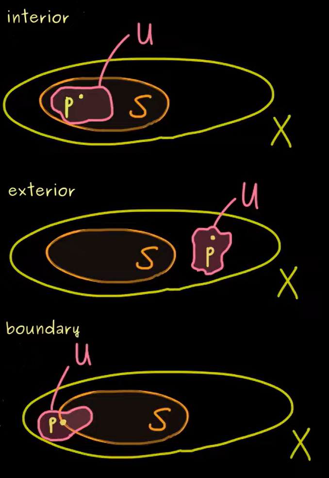

In simple words, **Manifolds** are "generalized surfaces". The simplest example of a manifold is the surface of a $2d$ sphere, which is usually denoted by $S^2$.
In this course, we'll first talk about Topology, then we'll move on to Differentiable Manifolds and at last talk about Differential Forms. The ultimate goal is to reach the generalized **Stokes' Theorem**.

__Definition__: A **Metric Space** $(X, d)$ is a set $X$ with a distance function $d: X \times X \rightarrow \mathbb{R}$. (For more info refer to the [Functional Analysis Notes]()

Now, we can see that for a lot of things, we don't need an explicit measure of distance, but just some neighborhood relations between the points might be sufficient. (i.e. Just need to know which points are $\epsilon$-neighbors of a point $x_0$ without knowing all the distances)\ 
The abstraction of this idea is where the concept of _Topology_ comes in.

__Definition__: A **Topology** $\tau$ on a set $X$ is defined as a collection $\tau$ of subsets of $X$, called _open sets_ and satisfying the following axioms:

1. $\emptyset, X \in \tau$
2. If $\{U_{\alpha}\}_{\alpha \in I}$ is a collection of elements of $\tau$, then $\bigcup_{\alpha \in I} U_{\alpha} \in \tau$
3. If $\{U_1, U_2, \dots, U_n\}$ is a finite collection of elements of $\tau$, then $\bigcap_{i = 1}^n U_i \in \tau$

Note that the set together with the chosen topology, $(X, \tau)$ is called a **Topological Space**.

Examples:
1. The **discrete topology** on $X$ is the topology $\tau = \mathcal{P}(X)$, i.e. the collection of all subsets of $X$.
2. The **indiscrete topology** on $X$ is the topology $\tau = \{\emptyset, X\}$.

## Interior, Exterior and Boundary

For a topological space $(X, \tau)$, a subset $S \subseteq X$ and a point $p \in X$, we define the following:

1. $p$ is an **interior point** of $S$ if there exists an open set $U \in \tau$ such that $p \in U \subseteq S$.
2. $p$ is an **exterior point** of $S$ if there exists an open set $U \in \tau$ such that $p \in U \subseteq X \setminus S$.
3. $p$ is a **boundary point** of $S$ if for every open set $U \in \tau$ containing $p$, $U \cap S \neq \emptyset$ and $U \cap (X \setminus S) \neq \emptyset$.
Visually, these correspond to the following conditions: 